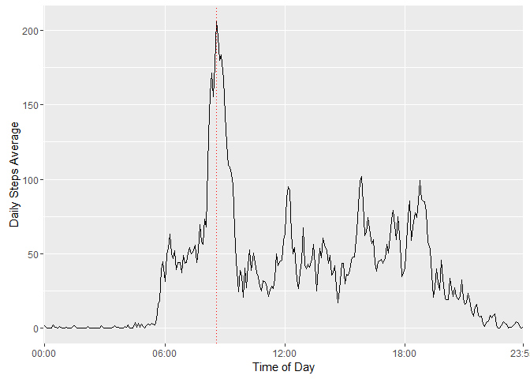

# Reproducible Research: Peer Assessment 1


## Loading and preprocessing the data


```r
activities <- read.table(unz("activity.zip","activity.csv"),head=TRUE,sep=",",na.strings ="NA")
head(activities)
```

```
##   steps       date interval
## 1    NA 2012-10-01        0
## 2    NA 2012-10-01        5
## 3    NA 2012-10-01       10
## 4    NA 2012-10-01       15
## 5    NA 2012-10-01       20
## 6    NA 2012-10-01       25
```

## What is mean total number of steps taken per day?

```r
require(dplyr)
```

```
## Loading required package: dplyr
```

```
## 
## Attaching package: 'dplyr'
```

```
## The following objects are masked from 'package:stats':
## 
##     filter, lag
```

```
## The following objects are masked from 'package:base':
## 
##     intersect, setdiff, setequal, union
```

```r
totalStepsPerDay <- activities %>% group_by(date) %>% summarize(steps=sum(steps,na.rm=TRUE))
hist(totalStepsPerDay$steps,xlab="Total Steps Per Day",main="Histogram for Total Steps Per Day")
```

<!-- -->

```r
mean(totalStepsPerDay$steps,na.rm=TRUE)
```

```
## [1] 9354.23
```

```r
median(totalStepsPerDay$steps,na.rm=TRUE)
```

```
## [1] 10395
```

## What is the average daily activity pattern?

```r
require(dplyr)
require(ggplot2)
```

```
## Loading required package: ggplot2
```

```r
averageStepsPerInterval <- activities %>% group_by(interval) %>% summarize(mean=mean(steps,na.rm=TRUE))
averageStepsPerInterval$interval <- as.factor( sprintf("%02d:%02d",averageStepsPerInterval$interval%/%100,averageStepsPerInterval$interval%%100))
ggplot(averageStepsPerInterval,aes(interval,mean)) + 
          geom_line(group=1) + 
          scale_x_discrete(breaks=c("00:00","06:00","12:00","18:00","23:55")) +
          labs(x="Time of Day",y="Daily Steps Average") +
          geom_vline(xintercept = which.max(averageStepsPerInterval$mean), colour = "red", linetype="dotted" )
```

<!-- -->

#### Interval with the Maximum Mean

```r
averageStepsPerInterval[which.max(averageStepsPerInterval$mean),]
```

```
## Source: local data frame [1 x 2]
## 
##   interval     mean
##     (fctr)    (dbl)
## 1    08:35 206.1698
```

## Imputing missing values
#### Total Number of Rows with NA values

```r
nrow(activities[is.na(activities$steps),])
```

```
## [1] 2304
```
### Create new data set and replace NAs with interval median
#### Compute for the median per interval.  COMPUTING PER DAY WILL NOT YIELD ANY DIFFERENCE..

```r
activities$steps <- ifelse(is.na(activities$steps),
                           ave(activities$steps,activities$interval,FUN=function(x) median(x,na.rm=TRUE)),
                           activities$steps)
```

#### Create new report after replacing NAs with computed values

```r
newTotalStepsPerDay <- activities %>% group_by(date) %>% summarize(steps=sum(steps))
hist(newTotalStepsPerDay$steps,xlab="New Total Steps Per Day",main="New Histogram for Total Steps Per Day")
```

<!-- -->

```r
mean(newTotalStepsPerDay$steps,na.rm=TRUE)
```

```
## [1] 9503.869
```

```r
median(newTotalStepsPerDay$steps,na.rm=TRUE)
```

```
## [1] 10395
```

## Are there differences in activity patterns between weekdays and weekends?
### Add a column indicating the day of the week for the dataset

```r
activities$wday <- as.factor(  ifelse( as.POSIXlt(activities$date)$wday %in% c(0,6),
                                       "Weekend",
                                       "Weekday"
                                     )
                            )
head(activities)
```

```
##   steps       date interval    wday
## 1     0 2012-10-01        0 Weekday
## 2     0 2012-10-01        5 Weekday
## 3     0 2012-10-01       10 Weekday
## 4     0 2012-10-01       15 Weekday
## 5     0 2012-10-01       20 Weekday
## 6     0 2012-10-01       25 Weekday
```

```r
averageStepsPerInterval <- activities %>% group_by(interval,wday) %>% summarize(mean=mean(steps,na.rm=TRUE))
averageStepsPerInterval$interval <- as.factor( sprintf("%02d:%02d",averageStepsPerInterval$interval%/%100,averageStepsPerInterval$interval%%100))
ggplot(averageStepsPerInterval,aes(interval,mean)) + 
          geom_line(group=1) + 
          scale_x_discrete(breaks=c("00:00","06:00","12:00","18:00","23:55")) +
          labs(x="Time of Day",y="Daily Steps Average") +
          facet_grid( wday ~ .)
```

<!-- -->
